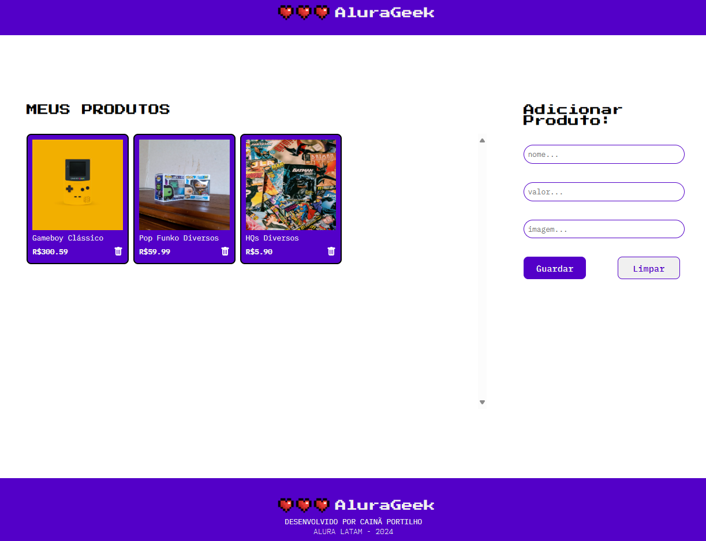

# AluraGeek

## 📝 Descrição

AluraGeek é uma aplicação web para gerenciamento de produtos em uma plataforma de e-commerce. O sistema oferece funcionalidades para listar, adicionar e excluir produtos através de uma interface intuitiva.

Esse projeto faz parte do `Challenge AluraGeek` em parceria com `Oracle One Next Education`.

## 🚀 Funcionalidades

- Visualização da lista de produtos
- Adição de novos produtos com nome, preço e imagem
- Exclusão de produtos existentes
- Exibição responsiva de cards de produtos
- Atualizações em tempo real sem recarregar a página

## 🛠️ Tecnologias Utilizadas

- HTML5
- JavaScript
- REST API
- Mock API (mockapi.io)
- Async/Await para operações com API
- Padrão de módulos
- Manipulação do DOM

## Operações Disponíveis na API:

- `GET` `/produtos` - Listar todos os produtos
- `POST` `/produtos` - Adicionar novo produto
- `DELETE` `/produtos/{id}` - Excluir produto por ID